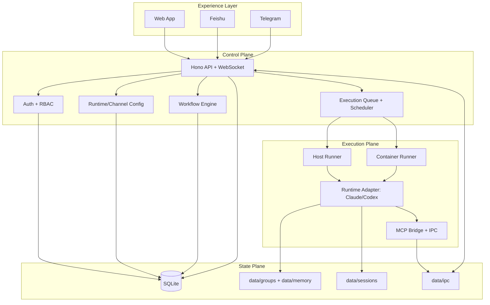

<p align="center">
  
</p>

<h1 align="center">SoloMesh</h1>

<p align="center">
  Self-hosted multi-user AI agent workspace with runtime abstraction (Claude/Codex), workflow orchestration, and multi-channel collaboration.
</p>

<p align="center">
  <a href="README.md">English</a> | <a href="README.zh-CN.md">简体中文</a>
</p>

<p align="center">
  <a href="LICENSE"></a>
  <a href="https://nodejs.org"></a>
  
  <a href="https://github.com/kexuejin/solomesh/stargazers"></a>
</p>

---

## Overview

SoloMesh turns agent runtimes into a practical collaboration system.

SoloMesh is built on a runtime abstraction (`claude` / `codex`) and provides workspace isolation, channel routing, workflow orchestration, and operational controls.

## Product Positioning

Based on the current codebase, SoloMesh is positioned around five core directions:

1. **Runtime abstraction**: uses `agentRuntime` (`claude` / `codex`) as the runtime selection model.
2. **Capability-driven setup**: setup and settings are rendered from runtime capabilities, not hard-coded provider assumptions.
3. **Workflow orchestration**: multi-stage templates with dependency precheck and lifecycle management.
4. **Session binding and merge logic**: IM sessions can bind to target workspaces, with controlled message-merge rules.
5. **Provider-aware Skills/MCP**: runtime-aware skill install/sync and per-user MCP server management.

## Core Capabilities

### Runtime and Provider Control

- Runtime catalog and active runtime state via `/api/config/runtimes`.
- Runtime config API family under `/api/config/runtime*`:
  - default runtime
  - encrypted secrets
  - custom environment overrides
  - runtime-wide apply/reload actions
- Claude official OAuth flow: `/api/config/runtime/oauth/start` and `/api/config/runtime/oauth/callback`.
- Codex credentials with optional base URL and model override.

### Collaboration Channels

- Native channels: **Web**, **Feishu**, **Telegram**.
- System-level channel config: `/api/config/feishu`, `/api/config/telegram`.
- User-level channel config and bindings: `/api/config/user-im/*`.
- Telegram pairing-code flow for user-level linking.

### Workspace Execution Model

- Per-user home workspace defaults:
  - admin: `folder=main`, default `host` execution
  - member: `folder=home-{userId}`, default `container` execution
- Host and container modes can run side by side.
- Queue-based execution scheduling and session lifecycle management.

### Workflow Templates

- Built-in templates plus user/global templates.
- Template lifecycle: `draft` -> `published` -> `archived`.
- Stage dependency types: `provider`, `skill`, `channel`, `mcp`.
- Publish-time dependency checks with optional auto-fix paths.

### Tooling and Operations

- Memory management across `user-global`, `main`, `flow`, and `session` scopes.
- Scheduled tasks: `cron`, `interval`, `once`, with run logs.
- Skills: search, install, sync-host (toggle is intentionally read-only in Web/API).
- MCP servers per user (`stdio`, `http`, `sse`) with host sync support.
- File browser, web terminal, monitor dashboard, and sub-agent conversation management.

### Security and Governance

- Cookie session auth and login lockout controls.
- RBAC plus permission templates (`admin_full`, `member_basic`, `ops_manager`, `user_admin`).
- Encrypted secret storage for runtime and channel credentials.
- Mount allowlist checks and path traversal protection.

## Architecture

### Terminology Contract

SoloMesh follows a strict 3-layer terminology model:

- `agentRuntime`: execution engine (`claude`, `codex`)
- `modelProvider`: model vendor (`anthropic`, `openai`, `openrouter`, ...)
- `model`: concrete model id (`claude-sonnet-*`, `gpt-*`, ...)

References:

- `docs/architecture/runtime-model-glossary.md`
- `docs/architecture/adr-0001-runtime-model-separation.md`

### Architecture Planes

| Plane | Responsibility | Key Modules |
| --- | --- | --- |
| **Experience Layer** | UI and IM entrypoints | `web/src/*`, Feishu/Telegram adapters |
| **Control Plane** | auth, RBAC, config, routing, workflows, scheduling | `src/web.ts`, `src/routes/*`, `src/workflow.ts`, `src/group-queue.ts` |
| **Execution Plane** | host/container runtime execution and stream handling | `src/container-runner.ts`, `container/agent-runner/src/index.ts` |
| **State Plane** | durable state, workspace files, memory, IPC | `src/db.ts`, `data/*` |

### Architecture Diagram (Reworked)



### Request Lifecycle

1. A message enters through Web, Feishu, or Telegram.
2. Control plane authenticates user/session, resolves workspace and runtime context.
3. Queue dispatches execution to host or container runner.
4. Runtime produces streaming events and optional MCP interactions.
5. State updates are persisted (DB/files), and output is pushed back to the originating channel.

### Key Source Map

- `src/index.ts`: application bootstrap and orchestration loop
- `src/web.ts`: API + WS server composition
- `src/runtime-config.ts`: runtime/channel config and secret encryption
- `src/routes/config.ts`: runtime and channel endpoints
- `src/workflow.ts`, `src/routes/workflows.ts`: workflow template model and APIs
- `src/group-message-merge.ts`: message query merge policy
- `src/im-channel-config-descriptor.ts`: channel config descriptor abstraction
- `container/agent-runner/src/index.ts`: runtime-side execution loop

### Runtime Data Layout

```text
data/
  config/          # runtime/channel configs and encrypted keys
  db/              # SQLite database
  groups/          # workspace data (incl. user-global memory folders)
  sessions/        # runtime session state (.claude/.codex)
  memory/          # scoped memory files
  skills/          # per-user skills
  mcp-servers/     # per-user MCP server configs
  ipc/             # host <-> runner IPC files
```

## Quick Start

### Prerequisites

- Node.js >= 20
- Optional: Docker (recommended for container execution mode)

### Install and Run

```bash
git clone https://github.com/kexuejin/solomesh.git
cd solomesh
make start
```

Open `http://localhost:3000`, then complete setup:

1. Create initial admin account (`/setup`)
2. Configure runtime credentials (`/setup/providers`)
3. Optionally configure user channels (`/setup/channels`)

## Development

```bash
make install         # install all dependencies
make dev             # backend + frontend dev mode
make dev-backend     # backend only
make dev-web         # frontend only
make build           # build backend + web + agent-runner
make typecheck       # full type check
make start           # production start (with build)
make reset-init      # reset runtime data (destructive)
```

## API Surface (Key)

- Runtime: `/api/config/runtimes`, `/api/config/runtime`, `/api/config/runtime/secrets`, `/api/config/runtime/custom-env`, `/api/config/runtime/apply`
- Channels (system): `/api/config/feishu`, `/api/config/telegram`
- Channels (user): `/api/config/user-im/*`
- Workflows: `/api/workflows/templates/*`
- Tasks: `/api/tasks/*`
- Skills: `/api/skills/*`
- MCP Servers: `/api/mcp-servers/*`

## Repository Layout

```text
src/                     # backend (Hono + orchestration + integrations)
web/                     # frontend (React + Vite + PWA)
container/agent-runner/  # runtime runner for host/container execution
container/skills/        # project-level skills
config/                  # static configuration
docs/architecture/       # glossary + ADRs
```

## Contributing

Issues and pull requests are welcome.

## License

MIT
