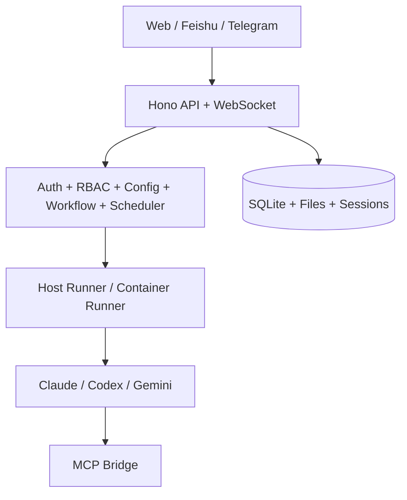

<p align="center">
  
</p>

<h1 align="center">SoloMesh</h1>

<p align="center">
  One control plane for your AI team.
</p>

<p align="center">
  SoloMesh is a self-hosted multi-user AI Agent workspace that unifies <b>Claude Code</b>, <b>Codex</b>, and <b>Gemini CLI</b> with shared governance, collaboration, and automation.
</p>

<p align="center">
  <a href="README.md">English</a> | <a href="README.zh-CN.md">简体中文</a>
</p>

<p align="center">
  <a href="LICENSE"></a>
  <a href="https://nodejs.org"></a>
  
  <a href="https://github.com/kexuejin/solomesh/stargazers"></a>
</p>

---

## TL;DR

- You keep the power of native runtimes, but add team-level control.
- You get Web + Feishu + Telegram entrypoints in one place.
- You can run repeatable workflows and scheduled automation without glue scripts.
- You keep data in your own environment.

## Why Teams Pick SoloMesh

- One workspace for multiple runtimes: `claude`, `codex`, `gemini`
- Real multi-user collaboration: roles, permissions, personal workspaces, shared workspaces
- Built-in channels: Web, Feishu, Telegram
- Built-in operations: workflow templates, scheduler, logs, runtime config, MCP/Skills
- Safe-by-default controls: encrypted secrets, mount allowlist, host-mode permission checks

If you want your team to use AI runtimes like a real internal tool (not just scattered CLI sessions), SoloMesh is built for that.

## Who It's For

- Engineering teams that want shared AI workflows instead of personal-only local sessions
- AI platform / DevOps teams that need runtime governance, permission boundaries, and auditability
- Product teams that need one place to run Claude/Codex/Gemini without switching tools

## Typical Scenarios

1. Team Daily Operations
Use scheduled prompts to generate standups, release notes, or issue digests.

2. Multi-Stage Delivery Workflow
Run analysis -> implementation -> review templates with dependency checks.
Example: Claude for architecture, Codex for coding/testing, Gemini for final wrap-up.

3. IM-to-Workspace Routing
Route Feishu/Telegram conversations to specific workspaces with per-user controls.

4. Runtime Governance
Set default runtime, expose source of secrets, and prevent risky host access by role.

## Why Not Just Run CLI Directly?

| Topic | Raw CLI Sessions | SoloMesh |
| --- | --- | --- |
| Team Collaboration | Mostly personal sessions | Shared workspaces + permissions |
| Runtime Switching | Manual and fragmented | Unified runtime abstraction |
| Channels | Usually local terminal only | Web + Feishu + Telegram |
| Automation | External scripts needed | Built-in scheduler + templates |
| Governance | Ad hoc | RBAC + encrypted secrets + mount allowlist |

## What You Can Do Today

1. Chat in a clean web UI and switch runtime quickly.
2. Configure Claude/Codex/Gemini with official login or API key flow.
3. Bind Feishu/Telegram sessions to target workspaces.
4. Create automation tasks from templates and edit schedule visually.
5. Run workflow templates with stage dependencies and publish precheck.
6. Manage MCP servers and Skills per user/workspace.
7. Use Chinese/English UI (auto-detect system language, user override supported).
8. Keep runtime credentials and operational settings visible and governable for the team.

## Runtime Support

| Runtime | ID | Auth | Model Override | Custom Base URL | Memory File |
| --- | --- | --- | --- | --- | --- |
| Claude Code | `claude` | OAuth / setup-token / third-party token | No | Yes | `CLAUDE.md` |
| Codex | `codex` | `CODEX_API_KEY` / `OPENAI_API_KEY` | Yes | Yes (`OPENAI_BASE_URL`) | `AGENTS.md` |
| Gemini CLI | `gemini` | OAuth or `GEMINI_API_KEY` / `GOOGLE_API_KEY` | Yes | Yes (`GOOGLE_GEMINI_BASE_URL`) | `GEMINI.md` |

## Quick Start (3 Minutes)

For a local trial or internal team pilot:

### 1) Clone and start

```bash
git clone https://github.com/kexuejin/solomesh.git
cd solomesh
make start
```

### 2) Open app

Open `http://localhost:3000`.

### 3) Finish setup wizard

1. Create admin account (`/setup`)
2. Configure runtime credentials (`/setup/providers`)
3. Optionally configure channels (`/setup/channels`)

`make start` auto-installs missing dependencies and builds required parts.

## How It Works

1. A message enters from Web / Feishu / Telegram.
2. SoloMesh resolves workspace, runtime, and permissions.
3. Request is dispatched to host or container runner.
4. Runtime streams output and tool events.
5. Results and state are persisted, then pushed back to the channel.

## Under the Hood

### Runtime Control

- Runtime abstraction by `agentRuntime` (`claude` / `codex` / `gemini`)
- Runtime list and active runtime via `/api/config/runtimes`
- Gemini OAuth endpoints:
  - `/api/config/runtime/gemini/oauth/start`
  - `/api/config/runtime/gemini/oauth/callback`
- Key source visibility (`runtime` / `env` / `none`) and degraded-key detection

### Collaboration Channels

- System-level config: `/api/config/feishu`, `/api/config/telegram`
- User-level config and binding: `/api/config/user-im/*`
- Session binding + merged message query support

### Automation and Workflow

- Task schedules: `cron`, `interval`, `once`
- Template-based automation creation
- Workflow template lifecycle: `draft -> published -> archived`
- Dependency precheck (`provider`, `skill`, `channel`, `mcp`)
- Stage-level runtime strategy: assign different runtimes per stage (for example: Claude -> Codex -> Gemini)

### Skills, MCP, and Memory

- Provider-aware skills behavior
- Per-user MCP servers (`stdio`, `http`, `sse`)
- Runtime memory profile mapping:
  - `claude -> CLAUDE.md`
  - `codex -> AGENTS.md`
  - `gemini -> GEMINI.md`

### UI Localization

- Supported UI languages: `zh-CN`, `en`
- Default: system/browser language
- User-level language switch in profile

## Architecture at a Glance



### Data Layout

```text
data/
  config/          # runtime/channel config, encrypted secrets, OAuth artifacts
  db/              # sqlite
  groups/          # workspaces
  sessions/        # runtime sessions (.claude/.codex/.gemini)
  memory/          # scoped memory files
  skills/          # per-user skills
  mcp-servers/     # per-user MCP config
  ipc/             # host <-> runner IPC
```

## Development

```bash
make install         # install dependencies + build agent-runner
make dev             # backend + frontend
make dev-backend     # backend only
make dev-web         # frontend only
make build           # build all
make typecheck       # type check all
make reset-init      # reset runtime data (destructive)
```

## Key APIs

- Runtime config: `/api/config/runtime*`, `/api/config/runtimes`
- Channels: `/api/config/feishu`, `/api/config/telegram`, `/api/config/user-im/*`
- Workflows: `/api/workflows/templates/*`
- Tasks: `/api/tasks/*`
- Skills: `/api/skills/*`
- MCP servers: `/api/mcp-servers/*`

## Repository Layout

```text
src/                     # backend (routing, orchestration, integrations)
web/                     # frontend (React + Vite + PWA)
container/agent-runner/  # runtime runner
container/skills/        # project-level skills
docs/architecture/       # architecture notes and ADRs
```

## Contributing

Issues and PRs are welcome.

## License

MIT
