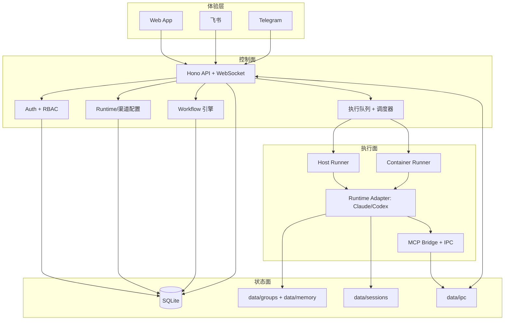

<p align="center">
  
</p>

<h1 align="center">SoloMesh</h1>

<p align="center">
  面向团队与个人的自托管多用户 AI Agent 工作空间，支持 Runtime 抽象（Claude/Codex）、工作流编排与多渠道协作。
</p>

<p align="center">
  <a href="README.md">English</a> | <a href="README.zh-CN.md">简体中文</a>
</p>

<p align="center">
  <a href="LICENSE"></a>
  <a href="https://nodejs.org"></a>
  
  <a href="https://github.com/kexuejin/solomesh/stargazers"></a>
</p>

---

## 项目概览

SoloMesh 的核心目标，是让 AI Agent Runtime 具备可协作、可治理、可持续运行的系统能力。

系统围绕 Runtime 抽象（`claude` / `codex`）构建，提供工作区隔离、消息通道路由、工作流编排与运维控制。

## 产品定位

结合当前代码状态，SoloMesh 的定位聚焦在 5 个方向：

1. **Runtime 抽象**：当前采用 `agentRuntime`（`claude` / `codex`）作为运行时选择模型。
2. **能力驱动设置流**：初始化与设置界面按 Runtime 能力渲染，不再绑定固定厂商语义。
3. **Workflow 编排能力**：模板支持多阶段依赖预检与完整生命周期管理。
4. **会话绑定与消息合并**：IM 会话可绑定目标工作区，消息查询可按策略合并。
5. **Provider-aware 的 Skills/MCP**：技能安装与同步可感知 Runtime，MCP 服务器按用户管理。

## 核心能力

### Runtime 与 Provider 控制

- Runtime 列表与激活状态：`/api/config/runtimes`。
- Runtime 配置族接口：`/api/config/runtime*`，覆盖：
  - 默认 Runtime
  - 加密密钥
  - 自定义环境变量
  - 全局应用/重载动作
- Claude 官方 OAuth：`/api/config/runtime/oauth/start`、`/api/config/runtime/oauth/callback`。
- Codex 支持 API Key + 可选 Base URL / Model 覆盖。

### 协作渠道

- 原生支持：**Web**、**飞书**、**Telegram**。
- 系统级渠道配置：`/api/config/feishu`、`/api/config/telegram`。
- 用户级渠道配置与绑定：`/api/config/user-im/*`。
- Telegram 支持配对码绑定流程。

### 工作区执行模型

- 每用户主工作区默认策略：
  - admin：`folder=main`，默认 `host` 执行
  - member：`folder=home-{userId}`，默认 `container` 执行
- 宿主机与容器模式可并存。
- 通过队列进行并发调度与会话生命周期管理。

### Workflow 模板编排

- 内置模板 + 用户/全局模板。
- 生命周期：`draft` -> `published` -> `archived`。
- 阶段依赖类型：`provider`、`skill`、`channel`、`mcp`。
- 发布前依赖预检，并支持缺失依赖的自动修复路径。

### 工具与运维能力

- 记忆管理覆盖 `user-global`、`main`、`flow`、`session` 四类范围。
- 定时任务支持 `cron`、`interval`、`once`，并提供执行日志。
- Skills 支持搜索、安装、宿主机同步（启停在 Web/API 中设计为只读）。
- MCP 服务器支持用户级配置（`stdio`、`http`、`sse`）与宿主机同步。
- 文件浏览、Web 终端、系统监控、子会话 Agent 管理。

### 安全与治理

- 基于 Cookie 的会话鉴权与登录锁定策略。
- RBAC 与权限模板（`admin_full`、`member_basic`、`ops_manager`、`user_admin`）。
- Runtime/渠道密钥加密存储。
- 挂载白名单与路径遍历防护。

## 架构说明

### 术语契约

项目采用严格的三层术语模型：

- `agentRuntime`：执行引擎（`claude`、`codex`）
- `modelProvider`：模型服务商（`anthropic`、`openai`、`openrouter` 等）
- `model`：具体模型 ID（`claude-sonnet-*`、`gpt-*` 等）

参考：

- `docs/architecture/runtime-model-glossary.md`
- `docs/architecture/adr-0001-runtime-model-separation.md`

### 架构分层（新版）

| 层/平面 | 职责 | 关键模块 |
| --- | --- | --- |
| **体验层** | Web 与 IM 接入 | `web/src/*`、飞书/Telegram 适配器 |
| **控制面** | 鉴权、配置、路由、工作流、调度 | `src/web.ts`、`src/routes/*`、`src/workflow.ts`、`src/group-queue.ts` |
| **执行面** | 宿主机/容器执行与流式事件处理 | `src/container-runner.ts`、`container/agent-runner/src/index.ts` |
| **状态面** | 持久化状态、工作区数据、记忆与 IPC | `src/db.ts`、`data/*` |

### 架构图（重构版）



### 一次请求的生命周期

1. 消息从 Web/飞书/Telegram 进入控制面。
2. 控制面完成鉴权、工作区解析、Runtime 上下文决策。
3. 队列将任务派发到宿主机或容器执行面。
4. Runtime 输出流式事件，并可通过 MCP 触发 IPC 交互。
5. 状态写入 DB/文件系统，结果回推到原始渠道。

### 关键代码地图

- `src/index.ts`：应用启动与编排主循环
- `src/web.ts`：API + WS 服务组合
- `src/runtime-config.ts`：Runtime/渠道配置与密钥加密
- `src/routes/config.ts`：Runtime 与渠道配置路由
- `src/workflow.ts`、`src/routes/workflows.ts`：Workflow 模板模型与接口
- `src/group-message-merge.ts`：消息合并策略
- `src/im-channel-config-descriptor.ts`：渠道配置抽象描述
- `container/agent-runner/src/index.ts`：运行时执行主循环

### 运行时数据目录

```text
data/
  config/          # runtime/channel 配置与加密密钥
  db/              # SQLite 数据库
  groups/          # 工作区数据（含 user-global 记忆目录）
  sessions/        # runtime 会话状态 (.claude/.codex)
  memory/          # 分范围记忆文件
  skills/          # 用户级 skills
  mcp-servers/     # 用户级 MCP 服务器配置
  ipc/             # 主进程与 runner 的 IPC 文件
```

## 快速开始

### 前置要求

- Node.js >= 20
- 可选：Docker（推荐用于 container 执行模式）

### 安装与启动

```bash
git clone https://github.com/kexuejin/solomesh.git
cd solomesh
make start
```

访问 `http://localhost:3000`，按向导完成：

1. 创建管理员账号（`/setup`）
2. 配置 Runtime 凭据（`/setup/providers`）
3. 可选配置个人通道（`/setup/channels`）

## 开发命令

```bash
make install         # 安装全部依赖
make dev             # 前后端开发模式
make dev-backend     # 仅后端
make dev-web         # 仅前端
make build           # 编译 backend + web + agent-runner
make typecheck       # 全量类型检查
make start           # 生产启动（自动构建）
make reset-init      # 重置运行数据（危险操作）
```

## 关键接口清单

- Runtime：`/api/config/runtimes`、`/api/config/runtime`、`/api/config/runtime/secrets`、`/api/config/runtime/custom-env`、`/api/config/runtime/apply`
- 系统渠道：`/api/config/feishu`、`/api/config/telegram`
- 用户渠道：`/api/config/user-im/*`
- Workflow：`/api/workflows/templates/*`
- Tasks：`/api/tasks/*`
- Skills：`/api/skills/*`
- MCP Servers：`/api/mcp-servers/*`

## 仓库结构

```text
src/                     # 后端（Hono + 编排 + 集成）
web/                     # 前端（React + Vite + PWA）
container/agent-runner/  # 宿主机/容器执行 runner
container/skills/        # 项目级 skills
config/                  # 静态配置
docs/architecture/       # 术语与 ADR
```

## 贡献

欢迎提交 Issue 和 Pull Request。

## 许可证

MIT
