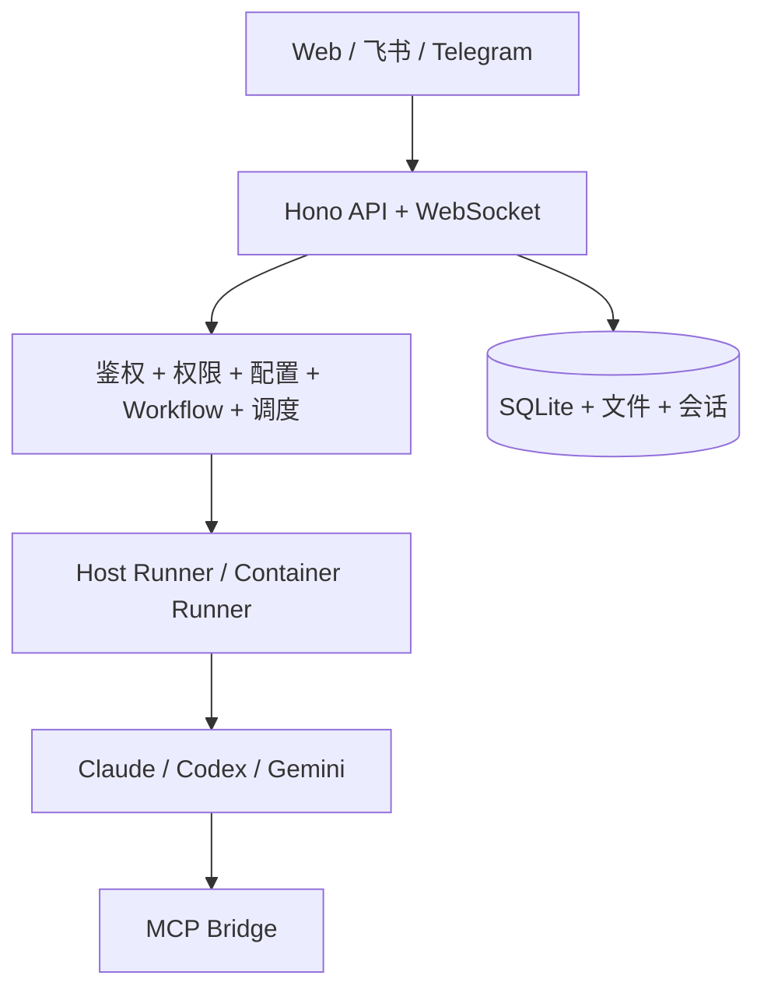

<p align="center">
  
</p>

<h1 align="center">SoloMesh</h1>

<p align="center">
  你的 AI 团队统一控制平面。
</p>

<p align="center">
  SoloMesh 是一个自托管多用户 AI Agent 工作空间，把 <b>Claude Code</b>、<b>Codex</b>、<b>Gemini CLI</b> 放在同一个产品里统一治理、协作和自动化。
</p>

<p align="center">
  <a href="README.md">English</a> | <a href="README.zh-CN.md">简体中文</a>
</p>

<p align="center">
  <a href="LICENSE"></a>
  <a href="https://nodejs.org"></a>
  
  <a href="https://github.com/kexuejin/solomesh/stargazers"></a>
</p>

---

## 一句话看懂

- 保留原生 runtime 能力，同时补上团队级控制能力。
- Web + 飞书 + Telegram 三端统一接入。
- 不写胶水脚本也能跑可复用工作流和自动化任务。
- 数据留在你自己的环境里。

## 为什么团队会选 SoloMesh

- 一个工作空间，同时支持多个 runtime：`claude`、`codex`、`gemini`
- 真正多用户：角色权限、个人工作区、共享工作区
- 内置渠道：Web、飞书、Telegram
- 内置运维能力：工作流模板、自动化调度、日志、MCP/Skills 管理
- 默认安全：密钥加密、挂载白名单、Host 模式权限控制

如果你希望团队把 AI runtime 当成“内部产品能力”来用，而不是分散的 CLI 会话，SoloMesh 就是为这个场景设计的。

## 适合谁用

- 希望把 AI 工作方式从“个人会话”升级为“团队协作流程”的研发团队
- 需要 runtime 治理、权限边界和可审计性的 AI 平台 / DevOps 团队
- 希望在一个产品内统一使用 Claude/Codex/Gemini 的产品与工程团队

## 典型使用场景

1. 团队日常自动化
用定时任务自动生成日报、发布摘要、异常汇总。

2. 多阶段交付流程
用模板跑 analysis -> implementation -> review，并在发布前检查依赖。
例如：Claude 做架构设计，Codex 做开发与测试，Gemini 做最终总结收敛。

3. IM 到工作区路由
把飞书/Telegram 会话绑定到指定工作区，并按用户权限控制。

4. Runtime 治理
统一默认 runtime，显示密钥来源，按角色限制高风险 host 操作。

## 为什么不直接跑 CLI？

| 对比项 | 直接跑 CLI | SoloMesh |
| --- | --- | --- |
| 团队协作 | 以个人会话为主 | 工作区共享 + 权限模型 |
| Runtime 切换 | 手动且分散 | 统一 runtime 抽象 |
| 渠道入口 | 通常只有本地终端 | Web + 飞书 + Telegram |
| 自动化 | 依赖外部脚本 | 内置调度与模板 |
| 治理能力 | 偏临时方案 | RBAC + 密钥加密 + 挂载白名单 |

## 现在就能做什么

1. 在统一 Web UI 聊天并快速切换 runtime。
2. 配置 Claude/Codex/Gemini（官方登录或 API Key）。
3. 把飞书/Telegram 会话绑定到指定工作区。
4. 通过模板快速创建自动化任务，并可视化编辑调度。
5. 用多阶段 Workflow 模板跑复杂流程，发布前自动预检依赖。
6. 按用户/工作区管理 MCP Server 和 Skills。
7. 用内置隧道和短链接把工作区安全暴露到公网访问。
8. 使用中英文界面（默认跟随系统语言，也可个人覆盖）。
9. 把凭据来源与关键配置透明化，便于团队治理和排障。

## 远程访问

SoloMesh 内置了远程访问内核，可把内网工作区地址通过隧道暴露并生成短链接。

- 隧道 Provider：`cloudflared`、`ngrok`
- 短链入口：`/r/<code>`
- 链接模式：
  - `token`：带过期时间（TTL）和可选一次性令牌
  - `public`：无 token、无过期时间
- 登录流程：未登录访问时会先跳转到 `/login`，登录后自动回到目标工作区路径。
- 助手自动回复：在 Web 会话和 IM 渠道（飞书/Telegram）里发送“远程访问”等请求，可自动回复当前工作区短链。

设置入口：`设置 -> 远程访问`

常用环境变量：

- `REMOTE_ACCESS_ENABLED`（`make start` 默认开启）
- `CLOUDFLARED_BIN`
- `NGROK_BIN`
- `REMOTE_ACCESS_AUTO_INSTALL_PROVIDERS`（默认自动安装 provider 可执行文件）

## Runtime 支持

| Runtime | ID | 鉴权方式 | 模型覆盖 | 自定义 Base URL | 主记忆文件 |
| --- | --- | --- | --- | --- | --- |
| Claude Code | `claude` | OAuth / setup-token / 第三方 token | 否 | 支持 | `CLAUDE.md` |
| Codex | `codex` | `CODEX_API_KEY` / `OPENAI_API_KEY` | 是 | 支持（`OPENAI_BASE_URL`） | `AGENTS.md` |
| Gemini CLI | `gemini` | OAuth 或 `GEMINI_API_KEY` / `GOOGLE_API_KEY` | 是 | 支持（`GOOGLE_GEMINI_BASE_URL`） | `GEMINI.md` |

## 快速开始（3 分钟）

用于本地体验或团队内部试点：

### 1）拉代码并启动

```bash
git clone https://github.com/kexuejin/solomesh.git
cd solomesh
make start
```

### 2）打开页面

访问 `http://localhost:3000`。

### 3）完成初始化向导

1. 创建管理员账号（`/setup`）
2. 配置 Runtime 凭据（`/setup/providers`）
3. 可选配置渠道（`/setup/channels`）

`make start` 会自动安装缺失依赖并完成必要构建。

## 工作机制

1. 消息从 Web / 飞书 / Telegram 进入。
2. SoloMesh 解析工作区、runtime 和权限。
3. 请求派发到 host 或 container runner。
4. Runtime 流式输出结果和工具事件。
5. 状态持久化后，把结果推回原渠道。

## 技术能力

### Runtime 控制

- 用 `agentRuntime` 抽象运行时（`claude` / `codex` / `gemini`）
- Runtime 列表与当前激活状态：`/api/config/runtimes`
- Gemini OAuth 接口：
  - `/api/config/runtime/gemini/oauth/start`
  - `/api/config/runtime/gemini/oauth/callback`
- API Key 来源可视化（`runtime` / `env` / `none`）和降级检测

### 协作渠道

- 系统级渠道配置：`/api/config/feishu`、`/api/config/telegram`
- 用户级渠道与绑定：`/api/config/user-im/*`
- 支持会话绑定与消息合并查询

### 自动化与 Workflow

- 调度类型：`cron`、`interval`、`once`
- 模板化自动化创建
- Workflow 模板生命周期：`draft -> published -> archived`
- 发布前依赖预检（`provider`、`skill`、`channel`、`mcp`）
- 支持按阶段指定 runtime（例如：Claude -> Codex -> Gemini）

### Skills、MCP、记忆体系

- Skills 行为具备 runtime 感知
- 用户级 MCP Server（`stdio`、`http`、`sse`）
- Runtime 记忆文件映射：
  - `claude -> CLAUDE.md`
  - `codex -> AGENTS.md`
  - `gemini -> GEMINI.md`

### UI 多语言

- 支持语言：`zh-CN`、`en`
- 默认跟随系统/浏览器
- 用户可在个人资料页切换

## 架构速览



### 数据目录

```text
data/
  config/          # runtime/channel 配置、加密密钥、OAuth 凭据
  db/              # sqlite
  groups/          # 工作区
  sessions/        # runtime 会话 (.claude/.codex/.gemini)
  memory/          # 分范围记忆文件
  skills/          # 用户级 skills
  mcp-servers/     # 用户级 MCP 配置
  ipc/             # host <-> runner IPC
```

## 开发命令

```bash
make install         # 安装依赖 + 构建 agent-runner
make dev             # 前后端开发模式
make dev-backend     # 仅后端
make dev-web         # 仅前端
make build           # 全量构建
make typecheck       # 全量类型检查
make reset-init      # 重置运行数据（危险操作）
```

## 关键 API

- Runtime 配置：`/api/config/runtime*`、`/api/config/runtimes`
- 渠道配置：`/api/config/feishu`、`/api/config/telegram`、`/api/config/user-im/*`
- 远程访问：
  - `/api/remote-access/status`
  - `/api/remote-access/tunnel/start`、`/api/remote-access/tunnel/stop`
  - `/api/remote-access/links`
  - `/api/remote-access/preferences`
  - `/api/remote-access/public/entry`
- Workflows：`/api/workflows/templates/*`
- Tasks：`/api/tasks/*`
- Skills：`/api/skills/*`
- MCP Servers：`/api/mcp-servers/*`

## 仓库结构

```text
src/                     # 后端（路由、编排、集成）
web/                     # 前端（React + Vite + PWA）
container/agent-runner/  # runtime runner
container/skills/        # 项目级 skills
docs/architecture/       # 架构说明与 ADR
```

## 贡献

欢迎提 Issue 和 PR。

## 许可证

MIT
